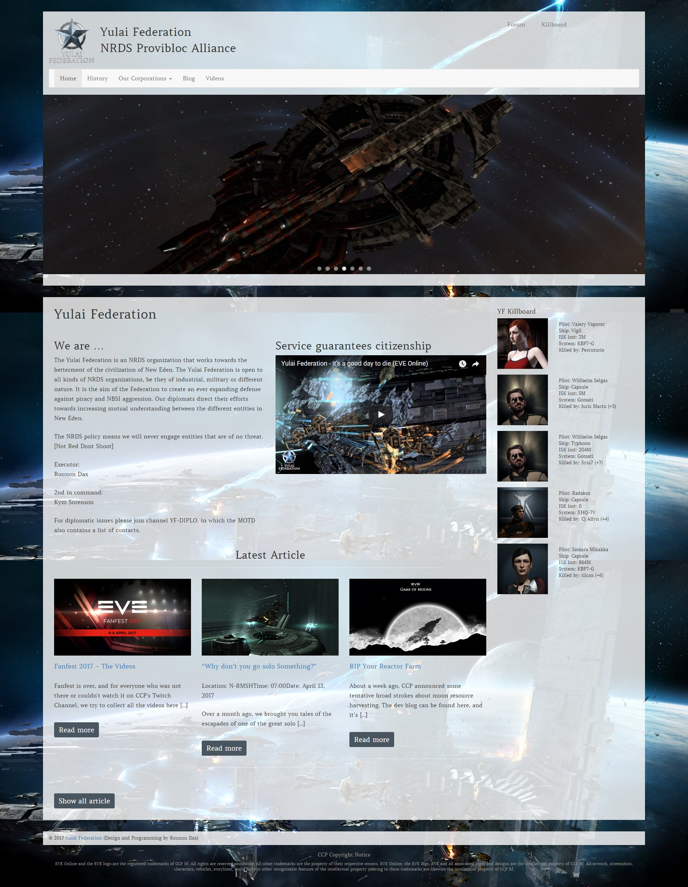

# EVE Online Theme for WordPress

## A beautifull WordPress theme inspired by the MMORPG EVE Online.

### Features:
* Can be used as corporation or alliance theme
* Fully responsive (adapts itself to mobile device displays)
* Clean look and feel

### Example


### Recommended Plugins:
* [Force Regenerate Thumbnails](https://wordpress.org/plugins/force-regenerate-thumbnails/)
* [Meta Slider](https://wordpress.org/plugins/ml-slider/)
* [WP Retina 2x](https://wordpress.org/plugins/wp-retina-2x/)

### Build-In Plugin Support for:
* [Meta Slider](https://wordpress.org/plugins/ml-slider/)
* [Fly Dynamic Image Resizer](https://wordpress.org/plugins/fly-dynamic-image-resizer/)
* [Categories Images](https://wordpress.org/plugins/categories-images/)
* [EVE Online Fitting Manager for WordPress](https://github.com/ppfeufer/eve-online-fitting-manager)
* [EVE Online Killboard Widget for WordPress](https://github.com/ppfeufer/eve-online-killboard-widget)

### Installation
To install the theme use git to clone it to your wordpress installation
```bash
git clone https://github.com/ppfeufer/eve-online-wordpress-theme.git eve-online
```
or [download the archive](https://github.com/ppfeufer/eve-online-wordpress-theme/archive/master.zip) or one of the [releases](https://github.com/ppfeufer/eve-online-wordpress-theme/releases), unzip the file and rename the folder to eve-online.

### Websites using this Theme (in alphabetical order):
* [Order of Order](http://www.orden.space/)
* [Terra Nanotech](https://terra-nanotech.de/)
* [The 1st Regiment](http://the1stregiment.tk/)
* [Yulai Federation](https://yulaifederation.net/)

Your corporation/alliance is also using this theme and you guys like it? Let me know :-)

### Additional Information
- [License](LICENSE)
- [CHANGELOG.md](CHANGELOG.md)
- [DOCUMENTATION.md](documentation/DOCUMENTATION.md)
- [Discord](https://discord.gg/YymuCZa)

### Todo List:
- [x] ~~Clean up the CSS files~~
- [x] ~~Make background image configurable~~
- [ ] Make theme plugins configurable
- [x] ~~Make content background colour configurable~~
- [x] ~~Rework the theme settings completely~~
- [ ] Generate color theme for Amarr
- [ ] Generate color theme for Gallente
- [ ] Generate color theme for Caldari
- [ ] Generate color theme for Minmatar

[](https://www.codacy.com/app/ppfeufer/eve-online-wordpress-theme?utm_source=github.com&utm_medium=referral&utm_content=ppfeufer/eve-online-wordpress-theme&utm_campaign=badger)
