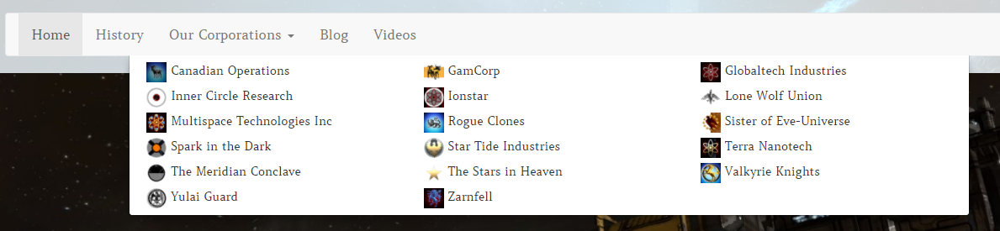
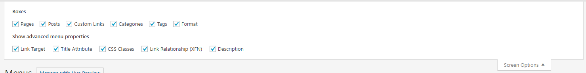
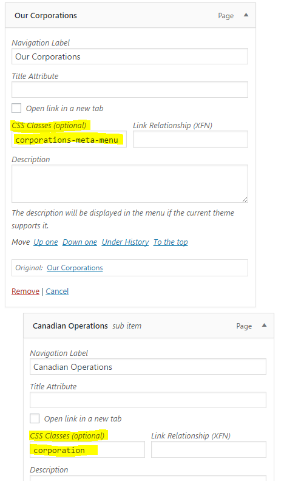

# Corporation Pages

**A short desciption on how to create a corporation menu.**

The corporation menu is nothing else than a special styled menü in your front end.

To get the corporation menu like this, you have to have pages set as corporation page and do some little tweaks in your custum menu. So go to Appearance > Menus and select your main menu. Here you open the Screen Options and make sure you have "CSS Classes" marked. "Title Attribute" is optional and can help with the styling if yuo are into it.
How to set pages as corporation pages, have a look here » [Corporation Pages](corporation-pages.md)

Once that is sorted you can go and edit your menu. The menu element hat has the corp pages as its sub, has to have the CSS Class "corporations-meta-menu". The Corporation pages should have the "Once that is sorted you can go and edit your menu. The menu element hat has the corp pages as its sub, has to have the CSS Class "corporations-meta-menu". The Corporation pages should have the "Once that is sorted you can go and edit your menu. The menu element hat has the corp pages as its sub, has to have the CSS class "corporations-meta-menu". The Corporation pages should have "corporation" as their CSS class.

If done right, your corporation menu should look like the one in the first image at the top of this little docu.
