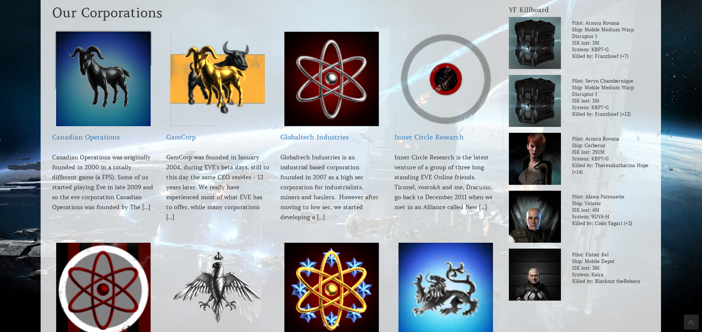

# Corporation Pages

**A way to create corp pages on an alliance website.**

When adding or editing a page, you might see a box called "Corp Page?", depending on your Screen options.

If you don't see this box, you just have to activate it in your screen options (see image).

### Marking a page as corp page

This box is controlling whether or not the page you are bout to create or edit is a marked as corporation page or not. If it is supposed to be a corporation page, you have to check the box "Is Corp Page?". With that, the page is marked as corporation page.
The second box "Show Corp Logo at the beginning of your page's content" determines if the corp's logo should be displayed at the beginning (floated right) of the pages content.
"Corporation Name" is somewhat self explaining I guess. Just put the name of the corpration in here, which's page it should be. Without a name, there won't be a logo as well.

### Listing the corp pages in frontend

To have all your alliances corps listed as an overview with a short excerpt of their discription, you only need to create a page and use the [corplist] short code as you can see in the image above. That's all and this will create a nice overview in your frontend.

