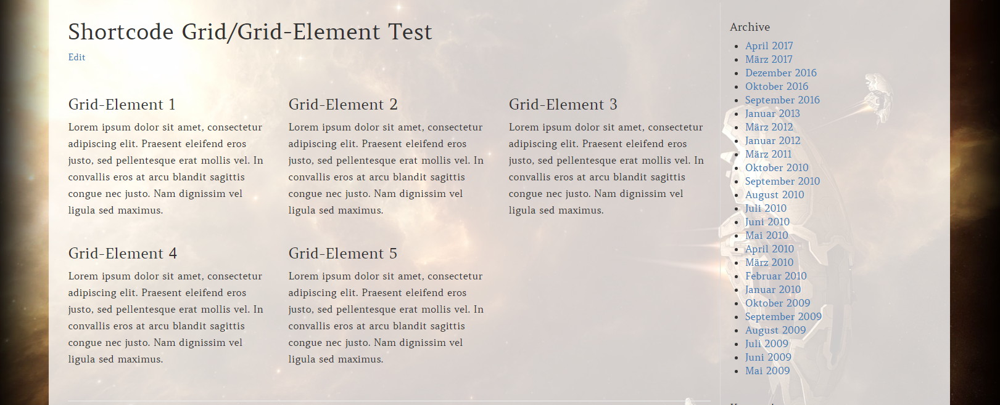
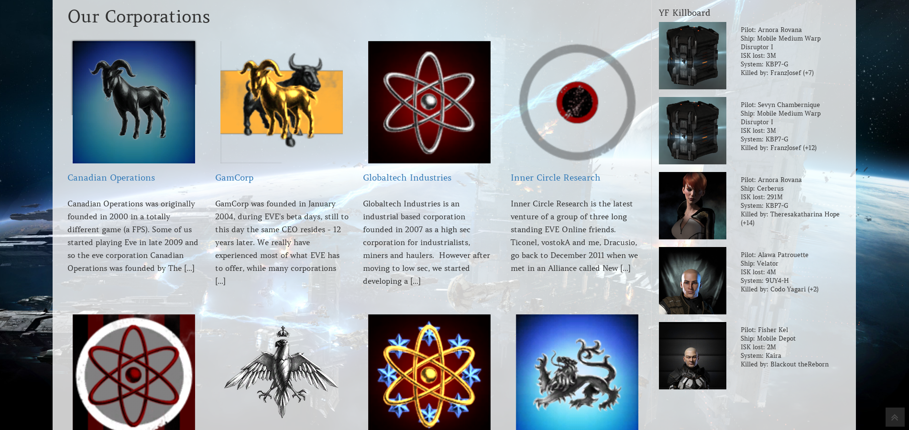

# Shortcodes

**This theme is providing a couple of shortcodes which can be used to style the content.**

### Automatic Grid System



With this theme using the bootstrap framework, of yourse you are able to set up a basic grid for some elements in your content as well. [contentgrid] is the shortcode that is used for that, together with [gridelement]. While [contentgrid] takes care of drawing the ourt grid frame, the [gridelement] shortcode has the content itself for your element.

Example:
```
[contentgrid classes="col-sm-6"]

[gridelement]

Grid-Element 1

[/gridelement]

[gridelement]

Grid-Element 2

[/gridelement]

[gridelement]

Grid-Element 3

[/gridelement]

[/contentgrid]
```

This will draw a contentgrid with 3 elements. The "classes" attribute is to define the grids behaviour and is using the known bootstrap classes. If that attribute is not used, the system determins the classes on its own. Meaning it will draw a grid of 3 elements per row when you are using a sidebar, and 4 elements a row when there is no sidebar.

### Columns

There are different shortcodes to create columns. They all are following a naming scheme which should make it obvious what type of column the shortcode generates.

- [two_columns_one] generates a single column in a 2 column layout
- [three_columns_one] generates a single column in a 3 column layout
- [three_columns_two] generates a single column spread over 2 columns in a 3 column layout
- [four_columns_one] generates a single column in a 4 column layout
- [four_columns_two] generates a single column spread over 2 columns in a 4 column layout
- [four_columns_three] generates a single columns spread over 3 columns in a 4 column layout

All column shortcodes accept "position" as option. Values can be "first" and "last". In fact, it has to be set for the first and teh last column, so the system known where to generate the rest of the HTML markup for the columns.

Example:
```
[three_columns_one position="first"]

Here goes some text

[/three_columns_one]

[three_columns_one]

Some more text

[/three_columns_one]

[three_columns_one position="last"]

And even more text

[/three_columns_one]
```

If no position is added to the first and the last column, it can lead to some unwanted effects. Unfortunately there is no real way to automatically determine the position.

### Divider

The [divider] simply is drawing a devider with a very fine line. Nothing fancy at all.

### Credits

The [credits] shortcode can be used right below your article to give some credits to who ever contributed to the articel, or made the pictures and so on. You know, the courtesy struff.

This shortcode accepts the parameter "headline" which determins what type the headline should be. Default is "h4". The headline text will always be "Credits".

Example (with a h2 headline):
```
[credits headline="h2"]

Your credits go here.

[/credits]
```

### Corp List

The [corplist] shortcode is interesting for alliance websites. This shortcode will get all published pages that are marked as being corp-pages (in the little corp pages box when editing page) and list them.

Example:
[Our Corporations](https://yulaifederation.net/our-corporations/)


